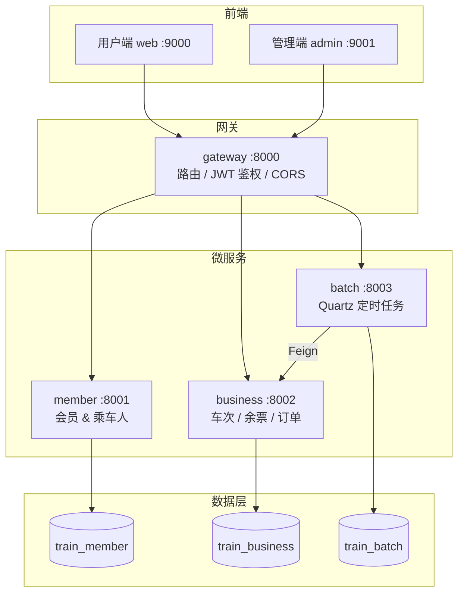

# 智行云平台

> 智行云火车票售票系统 — 基于 Spring Boot 3 微服务架构的完整火车票售票平台，涵盖会员管理、车次配置、余票查询、选座购票、订单确认及定时任务调度等核心能力。

[](https://openjdk.org/)
[](https://spring.io/projects/spring-boot)
[](https://vuejs.org/)
[](https://www.mysql.com/)

---

## 项目简介

**智行云平台**是一套前后端分离的火车票售票系统，模拟真实 12306 的核心业务流程。系统采用微服务拆分，通过 API 网关统一对外暴露接口，支持用户端购票与管理端运营配置两套界面。

适合用于：
- Spring Boot 3 / Spring Cloud 微服务学习与实践
- 前后端分离项目实战
- 火车票业务建模与数据库设计参考
- 定时任务（Quartz）与 Feign 远程调用示例

---

## 功能特性

### 用户端（web :9000）

| 功能 | 说明 |
|------|------|
| 手机验证码登录 | 短信验证码登录（开发环境固定验证码 `8888`） |
| 乘车人管理 | 新增、编辑、删除常用乘车人（成人/儿童/学生） |
| 余票查询 | 按日期、出发站、到达站查询可购车次及票价 |
| 在线购票 | 选择席别（一等座/二等座/软卧/硬卧），系统自动分配座位 |
| 订单查询 | 查看本人历史购票订单 |

### 管理端（admin :9001）

| 模块 | 功能 |
|------|------|
| 基础数据 | 车站、车次、途经站、车厢、座位配置 |
| 每日车次 | 按日期生成每日车次、余票、座位售卖状态 |
| 订单管理 | 查看所有确认订单 |
| 定时任务 | Quartz 任务增删改查、手动触发、暂停/恢复 |

### 后端服务

| 服务 | 端口 | 职责 |
|------|------|------|
| **gateway** | 8000 | API 网关、路由转发、JWT 登录鉴权、跨域处理 |
| **member** | 8001 | 会员注册/登录、乘车人 CRUD |
| **business** | 8002 | 车次/车站/余票/选座/订单核心业务 |
| **batch** | 8003 | Quartz 定时任务，自动生成 15 天后的每日车次数据 |

---

## 系统架构



### 网关路由规则

| 路径前缀 | 转发目标 |
|----------|----------|
| `/member/**` | `http://127.0.0.1:8001` |
| `/business/**` | `http://127.0.0.1:8002` |
| `/batch/**` | `http://127.0.0.1:8003` |

### 鉴权机制

- 用户端请求经网关 `LoginMemberFilter` 校验 JWT Token（Header: `token`）
- 白名单路径：`/admin/**`、`/hello`、登录、发送验证码接口
- 管理端接口不做登录拦截（适合本地开发调试）

---

## 技术栈

### 后端

| 技术 | 版本 | 用途 |
|------|------|------|
| Java | 17 | 运行环境（Spring Boot 3 最低要求） |
| Spring Boot | 3.0.0 | 微服务基础框架 |
| Spring Cloud Gateway | 2022.0.0 | API 网关 |
| MyBatis | 3.0.0 | ORM 持久层 |
| MySQL | 8.x | 关系型数据库 |
| Quartz | — | 定时任务调度 |
| OpenFeign | — | batch → business 远程调用 |
| JWT | — | 会员登录 Token |
| Hutool | 5.8.10 | 工具库 |
| PageHelper | 1.4.6 | 分页查询 |
| Snowflake | 自研 | 分布式 ID 生成 |

### 前端

| 技术 | 版本 | 用途 |
|------|------|------|
| Vue | 3.x | 前端框架 |
| Vue Router | 4.x | 路由与登录拦截 |
| Vuex | 4.x | 状态管理 |
| Ant Design Vue | 3.x | UI 组件库 |
| Axios | 1.x | HTTP 请求 |
| Vue CLI | 5.x | 构建工具 |

---

## 项目结构

```
zhixingyun-platform/
├── gateway/          # API 网关
├── member/           # 会员服务
├── business/         # 业务服务（核心）
├── batch/            # 批处理 / 定时任务
├── common/           # 公共模块（JWT、异常、拦截器、工具类）
├── generator/        # MyBatis 代码生成器
├── web/              # 用户端 Vue 项目
├── admin/            # 管理端 Vue 项目
├── sql/              # 数据库脚本
│   ├── member.sql        # 会员库表结构
│   ├── business.sql      # 业务库表结构
│   ├── batch.sql         # 批处理库表结构（Quartz）
│   ├── seed-data.sql     # 测试种子数据
│   └── full-dump.sql     # 完整数据库备份（含全部测试数据）
├── http/             # HTTP 接口调试文件（IDEA / VS Code）
├── pom.xml           # Maven 父工程
└── package.json      # 前端统一启动脚本
```

---

## 数据库设计

系统使用 **3 个独立数据库**，按微服务拆分：

### train_member（会员库）

| 表 | 说明 |
|----|------|
| `member` | 会员（手机号） |
| `passenger` | 乘车人（姓名、身份证、旅客类型） |

### train_business（业务库）

| 表 | 说明 |
|----|------|
| `station` | 车站 |
| `train` | 车次模板 |
| `train_station` | 车次途经站 |
| `train_carriage` | 车厢配置 |
| `train_seat` | 座位配置 |
| `daily_train` | 每日车次 |
| `daily_train_station` | 每日途经站 |
| `daily_train_carriage` | 每日车厢 |
| `daily_train_seat` | 每日座位（含售卖状态位图） |
| `daily_train_ticket` | 余票信息（区间票价） |
| `confirm_order` | 确认订单 |

### train_batch（批处理库）

| 表 | 说明 |
|----|------|
| `qrtz_*` | Quartz 调度器表（11 张） |

### 内置测试数据概览

| 数据 | 数量 |
|------|------|
| 车站 | 12 个（北京南、上海虹桥、广州南等） |
| 车次 | 6 趟（G1、G2、G3、D1、G101、G201） |
| 会员 | 11 人 |
| 乘车人 | 16 人 |
| 每日车次 | 15 天（2025-07-07 ~ 2025-07-21） |
| 余票记录 | 465 条 |

---

## 核心业务流程

### 购票流程

```
1. 用户登录（手机 + 验证码）
2. 维护乘车人信息
3. 查询余票（日期 + 出发站 + 到达站）
4. 选择车次、席别、乘车人
5. 提交订单 → 系统校验余票 → 自动分配座位 → 更新售卖状态
6. 查看订单记录
```

### 票价计算

```
票价 = 里程 × 座位单价 × 车次类型系数

车次类型系数：高铁 G = 1.2，动车 D = 1.0，快速 K = 0.8
座位单价：一等座 0.4元/km，二等座 0.3元/km，软卧 0.6元/km，硬卧 0.5元/km
```

### 每日车次生成

管理端配置好车次模板后，通过以下方式生成每日数据：

```bash
# 手动生成指定日期的每日车次（含车站、车厢、座位、余票）
GET http://localhost:8002/business/admin/daily-train/gen-daily/2025-07-22

# 或通过 batch 服务的 Quartz 定时任务自动生成（默认生成 15 天后的数据）
```

---

## 快速开始

### 环境要求

| 组件 | 版本 |
|------|------|
| JDK | 17+ |
| Maven | 3.6+ |
| MySQL | 8.0+ |
| Node.js | 16+ |

### 1. 克隆项目

```bash
git clone https://github.com/boyuan623-coder/zhixingyun-platform.git
cd zhixingyun-platform
```

### 2. 初始化数据库

**方式一：一键导入完整备份（推荐）**

```bash
mysql -u root -p < sql/full-dump.sql
```

**方式二：分步导入**

```bash
mysql -u root -p < sql/member.sql
mysql -u root -p < sql/business.sql
mysql -u root -p < sql/batch.sql
mysql -u root -p < sql/seed-data.sql
```

导入种子数据后，还需生成座位和每日车次：

```bash
# 生成各车次座位
curl http://localhost:8002/business/admin/train/gen-seat/G1
curl http://localhost:8002/business/admin/train/gen-seat/G2
# ... 其他车次同理

# 生成每日车次（需 business 服务已启动）
curl http://localhost:8002/business/admin/daily-train/gen-daily/2025-07-07
```

> 使用 `full-dump.sql` 可跳过上述步骤，数据已全部包含。

### 3. 配置数据库连接

各服务默认使用本地 MySQL，账号 `root` / `root`：

- `member/src/main/resources/application-local.properties`
- `business/src/main/resources/application-local.properties`
- `batch/src/main/resources/application-local.properties`

### 4. 编译后端

```bash
mvnw.cmd clean install -DskipTests    # Windows
./mvnw clean install -DskipTests      # Linux / macOS
```

### 5. 启动后端（按顺序）

| 顺序 | 主类 | 端口 |
|------|------|------|
| ① | `com.jiawa.train.member.config.MemberApplication` | 8001 |
| ② | `com.jiawa.train.business.config.BusinessApplication` | 8002 |
| ③ | `com.jiawa.train.batch.config.BatchApplication` | 8003 |
| ④ | `com.jiawa.train.gateway.config.GatewayApplication` | 8000 |

> ①②③ 可并行启动，④ 需等前三个服务就绪后再启动。

### 6. 启动前端

```bash
npm install
npm run install:all   # 安装 web + admin 依赖
npm run dev           # 同时启动用户端和管理端
```

### 7. 访问地址

| 页面 | 地址 |
|------|------|
| 用户端 | http://localhost:9000 |
| 管理端 | http://localhost:9001 |
| API 网关 | http://localhost:8000 |

### 测试账号

| 项目 | 值 |
|------|-----|
| 手机号 | `13000000001` ~ `13000000010` |
| 验证码 | `8888`（开发环境固定） |

---

## 接口调试

项目 `http/` 目录下提供了 `.http` 文件，可在 IntelliJ IDEA 或 VS Code（REST Client 插件）中直接调试：

```
http/member-member.http      # 会员注册、登录
http/member-passenger.http   # 乘车人管理
http/business-train.http     # 车次、座位生成
http/batch-job.http          # 定时任务管理
```

---

## 常见问题

**Q: IDEA 中无法启动，没有绿色运行按钮？**

请用 IDEA 打开 `train/` 目录（Maven 项目根目录），而非外层 `train-master/`，并等待 Maven 导入完成。

**Q: 网关返回 502？**

确认 member、business、batch 三个服务均已启动。

**Q: 查询不到车次？**

确认数据库已导入，且每日车次日期在 `2025-07-07` ~ `2025-07-21` 范围内。

**Q: JDK 版本报错？**

本项目基于 Spring Boot 3，必须使用 **JDK 17** 或以上版本。

---

## 作者

- **tuboyuan** — 项目原作者

---

## License

本项目仅供学习交流使用。
